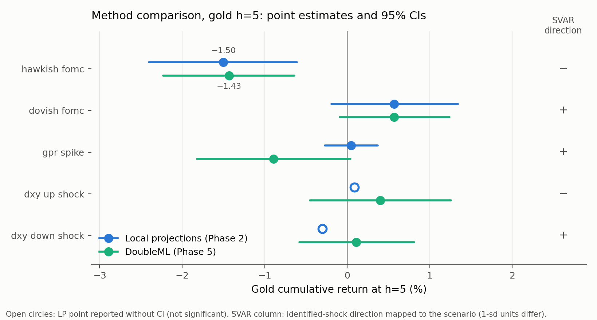

# Phase 5 — Causal triangulation: write-up (plan 5.10)

**2026-07-11. Phase 5 complete (5.1–5.9); this document is the synthesis.**
Detailed readouts: `phase5_dml_vs_lp_first_pass.md`,
`phase5_svar_cate_readout.md`; central table
`data/processed/scenario_master.parquet` (CSV mirror
`phase5_scenario_master.csv`).

## What was done

Three estimators with different bias profiles were pointed at the same five
event scenarios (identical treatment definitions, window 2010+):

1. **Jordà local projections** (Phase 2; HAC errors, linear controls),
2. **DoubleML-IRM** (LightGBM nuisances, 5-fold cross-fitting, 100-trial
   placebo p-values) — `metals.models.causal`,
3. **Sign-restricted SVAR** (NIW posterior + Haar rotations, baseline and
   alternative restriction sets) — `metals.models.svar`,

plus **CausalForestDML effect modification** on the Phase 3 regime labels
and a **subsample stability pass** (2010–14 / 2015–19 / 2020–26, fixed
event definitions). All specifications were fixed before estimation (the
scenario registry predates the runs; journal entries document each step).

## Robust findings (high agreement)

**1. Hawkish monetary surprises depress precious metals.** The project's
anchor result, now supported by three estimators and three eras: gold h=5
at −1.50% (LP), −1.43% (DML, placebo p < 0.01), and a matching
sign/scaled magnitude from the SVAR's real-yield shock (−0.55% per sd);
sign-stable in all three subsamples on Au/Ag/Pt with monotone magnitude
decay (−2.1% → −0.9%) consistent with QE-era leverage; effect ordering
Ag > Pt > Au preserved everywhere. Master-table scores: triangulation
1.00, cross-metal 1.00, stability 0.875.

**2. The hawkish/dovish asymmetry.** Dovish surprises produce small,
never-significant positives under both LP and DML (+0.57% gold h=5, both
methods). Metals respond to threats against the hedge thesis far more than
to marginal support of it — a regime-level fact worth its own paragraph in
the final write-up.

**3. Regime heterogeneity (suggestive tier).** The hawkish effect is
negative in *every* Phase 3 regime, with a ~10× amplitude range peaking in
the regime the LLM independently labelled `fed-rate-hike-expectations`
(−2.76% vs −0.26% in the weakest regime). Sign-universality is solid; the
ordering is suggestive (26 treated events; three regimes unpopulated).

## Disagreements, with hypotheses

**GPR spike** — LP null (+0.05), DML borderline-negative (−0.89, placebo
p=0.03, CI straddling zero), SVAR risk-aversion shock *positive* (+0.46,
band excluding zero). Hypothesis: the Caldara–Iacoviello daily index
measures news *intensity*, not flight-to-safety; its top-5% days pool
background news cycles with true crises. The SVAR, identifying
risk-aversion from comovements (yields ↓, equities ↓) rather than the
index, recovers the textbook safe-haven response — so the *channel* is
real and the *instrument* is the problem.

**DXY events vs the identified USD shock** — the event studies are null
(up-shocks) or sign-inverted (down-shocks, PGMs), while the SVAR's pure USD
shock hits gold canonically (−0.40 per sd, band excluding zero).
Hypothesis, now well-supported by the subsample pass: 2σ dollar moves are
not exogenous — down-shock events concentrate in risk-off/liquidation
episodes (the inversion is PGM-concentrated and lives in 2020–26, while
gold is textbook-positive there). Event-definition contamination, not a
broken channel.

## Scenarios failing robustness

Per the master table: `gpr_spike` (triangulation 0.33, stability 0.50,
cross-metal 0.50) and `dxy_down_shock` (0.33 / 0.50 / 0.50) fail;
`dxy_up_shock` is directionally stable but never significant (its 0.33
triangulation reflects the event-vs-identified-shock split above). None of
the three should be cited as standalone findings; all three earn their
keep as documented measurement lessons.

## Things I would have liked to test but couldn't

Listed per the plan's instruction that this matters more than the
headlines:

1. **CPI/NFP surprise scenarios** — no consensus-forecast ingestion exists
   (`available: false` in the registry). Macro-release surprises are the
   most obvious missing treatment family.
2. **Post-2023 FOMC events** — Bauer–Swanson MPS ends 2023-12. The 2024–26
   cutting cycle is entirely untested; an updated surprise series (or a
   futures-implied reconstruction) is the highest-value data extension.
3. **Cluster-defined treatments** — the plan envisaged Phase 3 regimes as
   *treatments*. Regime membership is a persistent state derived from
   market context, so "regime as treatment" has no clean counterfactual;
   I used regimes as effect *modifiers* instead. A defensible
   regime-transition treatment (entry days) remains undesigned.
4. **A powered CATE** — 26 treated events across 7 regimes cannot support
   per-regime point estimates. Doubling the event count (item 2) or
   coarsening to 2–3 super-regimes would make the heterogeneity test
   confirmatory rather than suggestive.
5. **Top-1% / continuous-magnitude GPR treatment** — the natural fix for
   the index-dilution hypothesis; deferred.
6. **Intraday identification** — daily bars cannot separate the FOMC
   announcement from same-day confounds; the LP timing note (futures
   settle before the statement) mitigates but high-frequency data would
   settle it.
7. **A 5th SVAR variable per metal** — the SVAR carries gold only;
   metal-specific blocks (esp. Pd with its supply regime) would test
   whether the PGM anomalies are identifiable shocks or noise.
8. **Formal multiplicity control** — 60 ATE cells; the placebo p-values and
   sign-agreement scores discipline the headline claims, but a
   family-wise correction across the full grid is deferred to Phase 6.

## Standing caveats

No-unmeasured-confounders is assumed by DML and untestable; sign
restrictions are a modelling choice (the alternative set agreed, which is
comfort, not proof); treatment thresholds are computed in-window (holdout
re-thresholding deferred to Phase 6); subsample FOMC cells hold 8–16
events and are sign-evidence only; the regime conditioning variable is
full-sample-trained and descriptive.

## Deliverables checklist (plan)

- [x] `metals.models.causal` — DoubleML ATE/placebo/CATE (27 tests)
- [x] `metals.models.svar` — sign-restricted IRFs, two restriction sets (6 tests)
- [x] `data/processed/scenario_master.parquet` — the central deliverable
- [x] `results/phase5_triangulation.md` — this document
